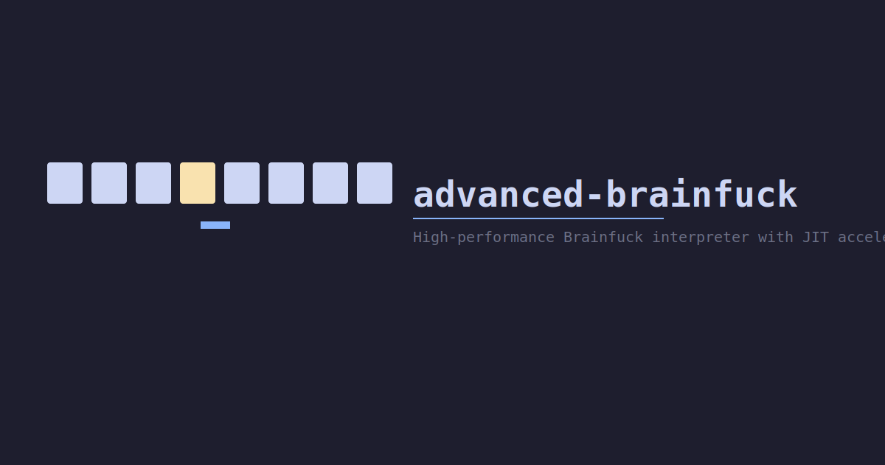

# advanced-brainfuck



A high-performance Brainfuck language interpreter for Python with JIT acceleration, library imports, and an interactive REPL.

**[Documentation](https://nullhack.github.io/advanced-brainfuck/)** | **[PyPI](https://pypi.org/project/advanced-brainfuck/)** | **[Changelog](CHANGELOG.md)**

---

## Features

- **JIT-accelerated execution** — Compiles Brainfuck programs to an intermediate representation (IR) with run-length encoding, then executes via Numba's `@jit(nopython=True)` for 3-5x speedup
- **Segmented JIT with checkpoints** — All programs use the JIT path; I/O operations (`,`, `*`, `&`) trigger checkpoints where Python handles input/output before resuming JIT execution
- **Interpreted fallback** — If JIT compilation fails, falls back to interpreted IR execution with full compatibility
- **Library system** — Import external `.bf` files with `{libname}` syntax; recursive imports supported
- **Interactive REPL** — Run `brainfuck` with no arguments for an interactive shell
- **Python API** — `from brainfuck import BrainFuck` for programmatic use

## Quick Start

### Installation

```bash
pip install advanced-brainfuck
```

### Command Line

```bash
# Run a program and exit
brainfuck --command-line '++++++++[>++++[>++>+++>+++>+<<<<-]>+>+>->>+[<]<-]>>.>---.+++++++..+++.>>.<-.<.+++.------.--------.>>+.>++.'

# Run a program from file (recommended for large programs)
brainfuck --command-line -f program.b

# Run a program then enter interactive REPL
brainfuck '+++++++++++++++++++++++++++++++++++++++++++++++++++.'

# Enter interactive REPL
brainfuck
```

### Python API

```python
from brainfuck import BrainFuck

bf = BrainFuck()
bf.execute('+++++++++++++++++++++++++++++++++++++++++++++++++++.')  # prints: 3
bf.execute('[-]')                    # clears cell 0
bf.execute('{p10}*{tochar}')         # imports and prints: |10|
bf.execute('&')                       # prints command history
bf.interpreter()                      # starts interactive REPL
```

## Brainfuck Commands

### Standard Commands

| Command | Description |
|---------|-------------|
| `>` | Increment the data pointer |
| `<` | Decrement the data pointer |
| `+` | Increment the value at the data pointer |
| `-` | Decrement the value at the data pointer |
| `.` | Output the value at the data pointer |
| `,` | Accept one integer of input |
| `[` | Jump forward past matching `]` if value is zero |
| `]` | Jump back to matching `[` if value is non-zero |

### Additional Commands

| Command | Description |
|---------|-------------|
| `{LIB}` | Import external Brainfuck code from `bflib/LIB.bf` |
| `*` | Output all cells with pointer highlighted |
| `&` | Output command history |
| `help` | Show command reference (REPL only) |

## Library Modules

The `bflib/` directory contains 31 reusable Brainfuck modules:

| Module | Description |
|--------|-------------|
| `sum` | Sum current cell and next cell |
| `sub` | Subtract next cell from current cell |
| `mul` | Multiply current cell by next cell |
| `mul2` | Multiply current cell by two |
| `div` | Divide current cell by next cell |
| `mod` | Modulo of current cell divided by next cell |
| `copy` | Copy current cell into next cell |
| `move` | Move current cell to next cell (copy + clear) |
| `swap` | Swap current cell and next cell |
| `zero` | Clear current cell (set to zero) |
| `not` | Logical NOT of current cell |
| `and` | Logical AND of current and next cell |
| `or` | Logical OR of current and next cell |
| `eq` | Test if current cell equals next cell |
| `if` | If current cell is non-zero, set next cell to 1 |
| `sqrt` | Integer square root of current cell |
| `p5` | Add 5 to current cell |
| `p10`, `p32`, `p48`, `p50`, `p65`, `p100` | Add 5, 10, 32 (space), 48 (digit '0'), 50, 65 ('A'), 100 to current cell |
| `m10`, `m50`, `m100` | Subtract 10, 50, 100 from current cell |
| `toint` | Convert ASCII digit character to integer |
| `tochar` | Convert integer (0-9) to ASCII character |
| `newline` | Output a newline character (ASCII 10) |
| `lower` | Convert uppercase ASCII to lowercase |
| `upper` | Convert lowercase ASCII to uppercase |

## Architecture

```
Source Code → Import Resolution → IR Compilation → Execution
                                                        ↓
                                               ┌── Segmented JIT ──┐
                                               │ execute_jit()      │
                                               │ via Numba          │
                                               │                    │
                                               │ Checkpoints at:    │
                                               │  , * &             │
                                               │                    │
                                               │ Python handles I/O │
                                               │ then resumes JIT   │
                                               └────────────────────┘
                                               ┌── Fallback ────────┐
                                               │ (JIT compilation   │
                                               │  failure only)     │
                                               │ Python IR loop     │
                                               └────────────────────┘
```

### IR Compilation

Source code is compiled to an intermediate representation with:
- **Run-length encoding** — `+++++` becomes `('add', 5)` in a single operation
- **Pre-resolved jumps** — `[` and `]` targets are computed at compile time
- **Numeric encoding** — IR tuples converted to NumPy int32 arrays for JIT

### Tape Memory

Cells use a pre-allocated NumPy tape of 65,536 cells (64K) for JIT execution, with a hybrid Python storage model for the REPL:
- Pre-allocated list of 30,000 integers for indices 0-29,999 (O(1) access)
- Sparse `defaultdict` for negative indices (rarely used but supported)

## Requirements

- Python >= 3.13
- Numba >= 0.58.0
- NumPy >= 1.24.0

## Project Structure

```
advanced-brainfuck/
├── brainfuck/               # Python package
│   ├── __init__.py          # Public API re-exports
│   ├── __main__.py          # python -m brainfuck entry point
│   ├── core.py              # Core interpreter, compiler, JIT, CLI
│   └── bflib/               # Reusable Brainfuck library modules
│       ├── sum.bf
│       ├── copy.bf
│       ├── mul.bf
│       ├── div.bf
│       ├── toint.bf
│       └── ...              # 31 modules total
├── docs/
│   ├── spec/              # Product & technical specifications
│   ├── adr/               # Architecture decision records
│   └── features/           # Feature specifications
├── tests/
│   └── features/           # Test files
├── pyproject.toml          # Package configuration
└── README.md
```

## License

GPLv3 — See [LICENSE](LICENSE) for details.