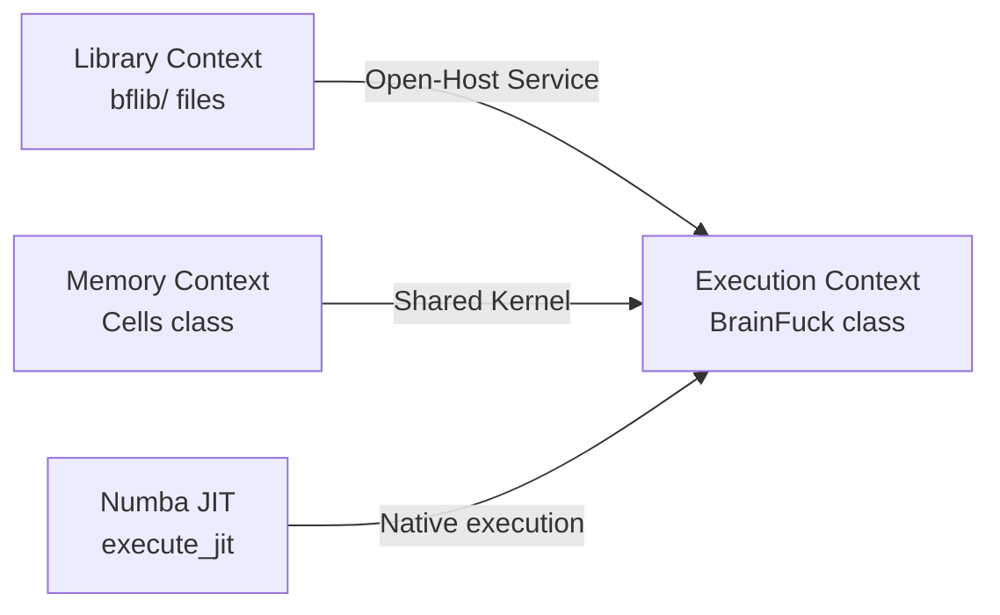

# Context Map: advanced-brainfuck

> DDD context map showing relationships between bounded contexts.

---

## Context Relationships

| Upstream Context | Downstream Context | Relationship Pattern | Translation / Anti-Corruption Layer |
|-----------------|-------------------|---------------------|-------------------------------------|
| Library | Execution | Open-Host Service | Library files are plain Brainfuck text; no translation needed — inlined directly into source |
| Memory | Execution | Shared Kernel | Cells and Pointer are accessed directly by the Execution context |

---

## Context Map Diagram

---

## Integration Points

| Integration | From | To | Mechanism | Contract |
|-------------|------|----|-----------|----------|
| Library resolution | Library | Execution | Filesystem read + string inlining | `.bf` files containing valid BF commands |
| Cell access | Memory | Execution | Direct method calls on `Cells` instance | `__getitem__`, `__setitem__`, `backup`, `print_pos` |
| JIT execution | Execution | Numba | NumPy array passing | `execute_jit(program, tape_size, max_iterations) → (output, tape, pointer, iterations)` |

---

## Anti-Corruption Layers

| ACL | Protects Context | From Context | Translation Rules |
|-----|-----------------|--------------|-------------------|
| IR Conversion | Execution | Numba JIT | IR tuples → NumPy int32 arrays; cell state → tape array centred at `tape_size // 2` |
| Import Filter | Execution | Library | Non-BF characters in `.bf` files are stripped during import resolution |

---

## Changes

| Date | Source | Change | Reason |
|------|--------|--------|--------|
| 2026-05-02 | Optimisation pass | Added JIT integration point | Performance |